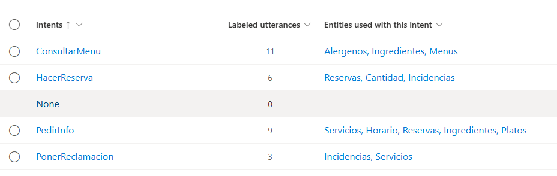
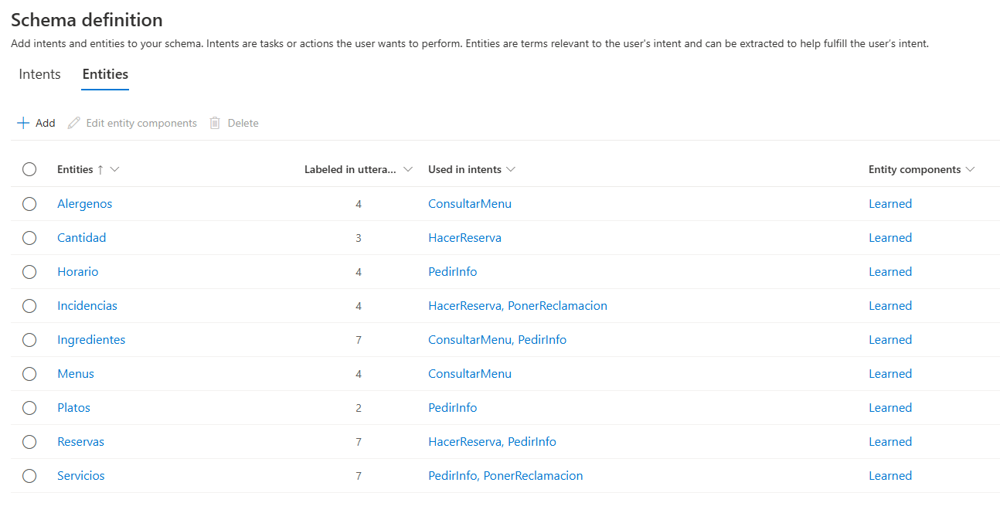
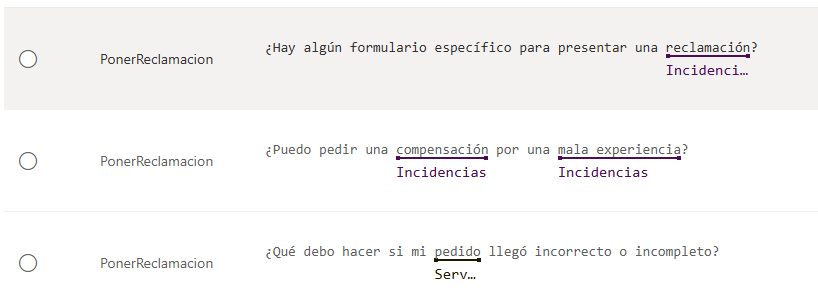
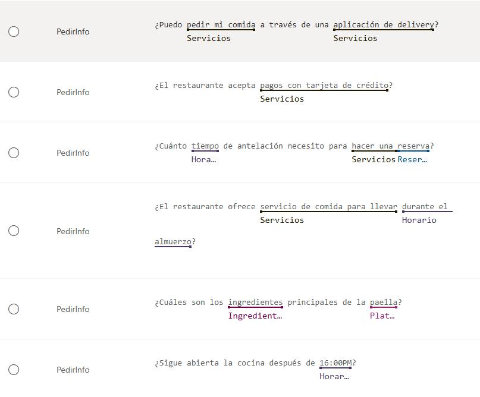
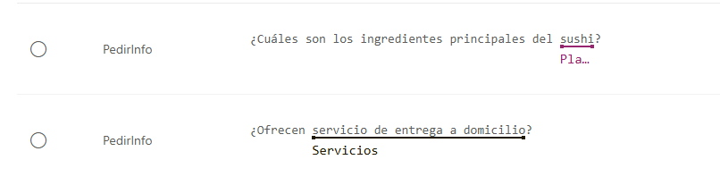
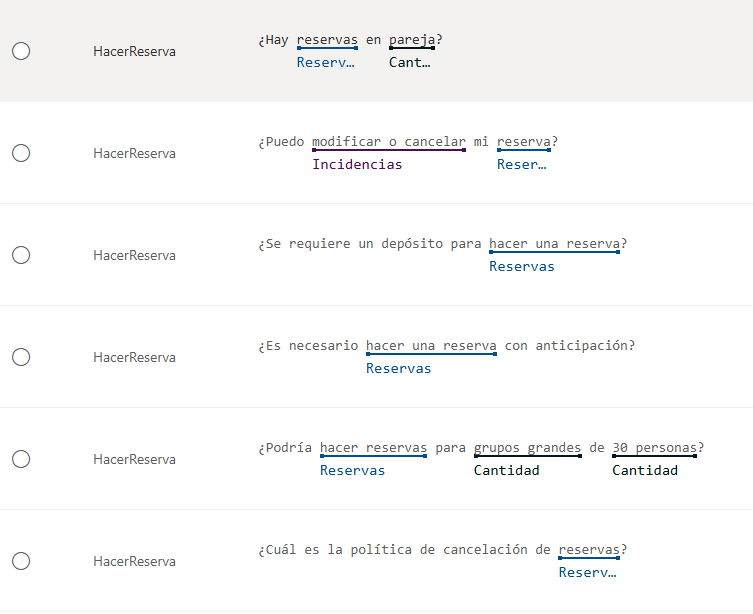
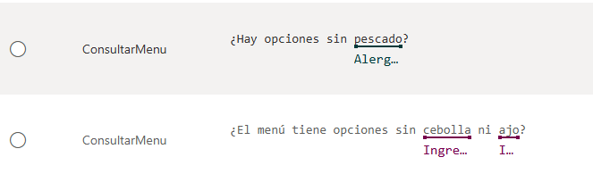
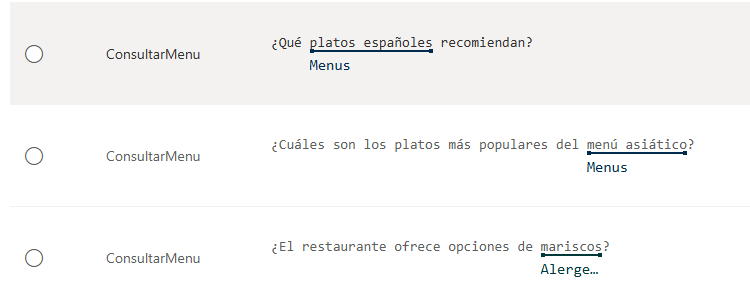
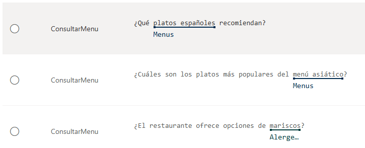

# Restaurante Chatbot

El proyecto es un chatbot para restaurantes que utiliza el servicio Azure Language para procesar las consultas de los usuarios. 

Su función principal es responder preguntas relacionadas con el menú, horarios, ubicaciones y otros aspectos del restaurante. Además, el chatbot es capaz de extraer intenciones y entidades de las preguntas, como el tipo de plato, preferencias de ingredientes o incluso fechas y horas específicas para reservas. 

Esto se logra mediante el uso de la API de Language Understanding (LUIS) de Azure, que permite interpretar el lenguaje natural y ofrecer respuestas precisas y contextuales.

Capturas del entrenamiento del Azure Language Service:

